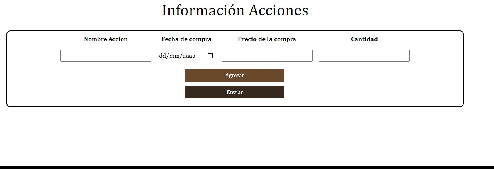
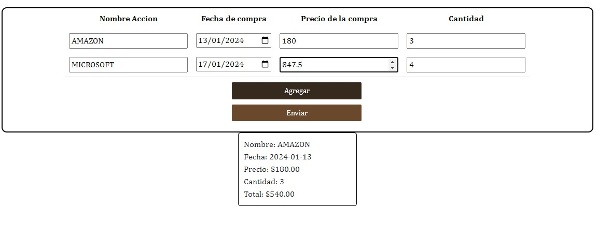

# Manual de usuario
# Aplicación Bolsa de NY

## Misión
El objetivo de este manual es proporcionar a los usuarios una guía detallada y accesible para el uso efectivo de la aplicación de registro y seguimiento de inversiones en acciones. A través de instrucciones claras y ejemplos prácticos, este manual busca facilitar a los usuarios la comprensión de las funcionalidades clave de la aplicación, permitiéndoles registrar compras de acciones, visualizar su cartera y buscar acciones específicas de manera eficiente

## Bienvenido
Bienvenido al Manual de Usuario de la Aplicación de Registro de Acciones. Esta aplicación ha sido diseñada para ofrecer a los usuarios una herramienta fácil y efectiva para gestionar sus inversiones en el mercado de acciones. Con características intuitivas y una interfaz amigable, nuestra aplicación le permite registrar sus compras de acciones, visualizar su cartera y buscar acciones específicas de manera rápida y sencilla. Este manual le proporcionará las instrucciones necesarias para aprovechar al máximo las funcionalidades de la aplicación, brindándole un mayor control y comprensión de sus inversiones. ¡Comencemos!

## Para comenzar
En primer lugar al iniciar la aplicación se mostrará la siguiente pantalla
 

Por favor, llenar los datos con la información requerida y dar clic en agregar y por último dar clic en enviar para que los datos posteriormente puedan ser visualizados.

